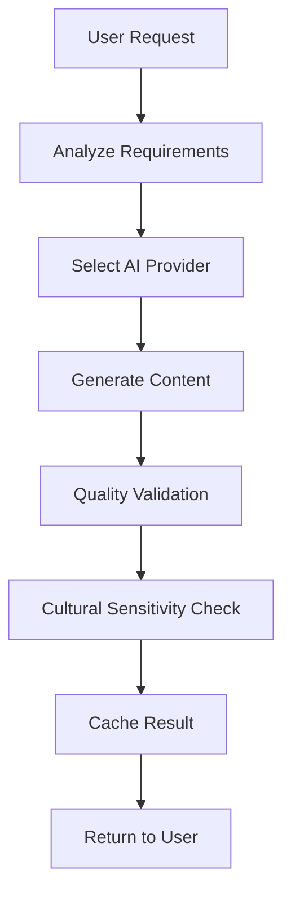

# LinguaLeap Technical Architecture

## Overview

LinguaLeap is an AI-powered personalized language learning platform built with a modern, scalable architecture designed to handle complex learning workflows, real-time AI interactions, and adaptive content delivery.

## System Architecture

### Technology Stack

#### Frontend Technologies
- **Framework**: React 18+ with TypeScript
- **Build Tool**: Vite for fast development and optimized builds
- **Styling**: Tailwind CSS with Radix UI component library
- **State Management**: Zustand for global state, TanStack Query for server state
- **Routing**: React Router with protected route handling
- **Animation**: Framer Motion for smooth transitions
- **PWA**: Service Worker for offline capability

#### Backend Technologies
- **Runtime**: Node.js 20+ LTS
- **Framework**: Express.js with TypeScript
- **Database**: PostgreSQL 15+ with Prisma ORM
- **Caching**: Redis for session storage and content caching
- **Authentication**: JWT with RS256 algorithm
- **Validation**: Zod for runtime type validation
- **File Upload**: Multer for multipart form handling
- **Logging**: Winston for structured logging

#### AI Integration
- **LLM Providers**: OpenAI GPT-4/3.5, Anthropic Claude, Google Gemini
- **Speech Recognition**: Self-hosted Whisper API
- **Text-to-Speech**: Integration with multiple TTS providers
- **Content Generation**: Advanced prompt engineering with context awareness
- **Safety**: Content filtering and cultural sensitivity validation

#### Infrastructure & DevOps
- **Containerization**: Docker and Docker Compose
- **CI/CD**: GitLab CI/CD with automated testing and deployment
- **Monitoring**: Prometheus metrics with Grafana visualization
- **Code Quality**: SonarQube for static analysis
- **Load Balancing**: Nginx for reverse proxy and load balancing
- **CDN**: Content delivery for static assets and media files

## Database Architecture

### Enhanced Schema Design for AI Course Management

#### Core User Management Tables

The enhanced database schema includes new tables specifically designed for AI-powered course management:

#### PersonalizedCourse Table
```sql
CREATE TABLE personalized_courses (
  id VARCHAR PRIMARY KEY DEFAULT gen_random_uuid(),
  user_id VARCHAR NOT NULL REFERENCES users(id) ON DELETE CASCADE,
  course_name VARCHAR NOT NULL,
  target_language VARCHAR NOT NULL,
  native_language VARCHAR NOT NULL,
  learning_motivation VARCHAR NOT NULL,
  proficiency_level user_level NOT NULL,
  course_tier VARCHAR NOT NULL CHECK (course_tier IN ('basic', 'premium', 'pro')),
  total_lessons INTEGER NOT NULL,
  estimated_duration_weeks INTEGER,
  ai_generation_metadata JSONB NOT NULL,
  course_structure JSONB NOT NULL,
  learning_objectives JSONB NOT NULL,
  cultural_context JSONB,
  price DECIMAL(10,2),
  completion_reward DECIMAL(10,2),
  progress_percentage DECIMAL(5,2) DEFAULT 0.00,
  is_active BOOLEAN DEFAULT true,
  ai_provider_used VARCHAR,
  generation_timestamp TIMESTAMPTZ DEFAULT NOW(),
  created_at TIMESTAMPTZ DEFAULT NOW()
);
```

#### CourseTask Table
```sql
CREATE TABLE course_tasks (
  id VARCHAR PRIMARY KEY DEFAULT gen_random_uuid(),
  course_id VARCHAR NOT NULL REFERENCES personalized_courses(id) ON DELETE CASCADE,
  task_order INTEGER NOT NULL,
  task_type VARCHAR NOT NULL,
  task_name VARCHAR NOT NULL,
  task_description TEXT,
  difficulty_level INTEGER NOT NULL CHECK (difficulty_level BETWEEN 1 AND 10),
  estimated_duration_minutes INTEGER,
  task_content JSONB NOT NULL,
  scoring_criteria JSONB,
  ai_feedback_prompts JSONB,
  prerequisites JSONB,
  learning_objectives JSONB,
  multimedia_assets JSONB,
  created_at TIMESTAMPTZ DEFAULT NOW()
);
```

#### UserGoals Table
```sql
CREATE TABLE user_goals (
  id VARCHAR PRIMARY KEY DEFAULT gen_random_uuid(),
  user_id VARCHAR NOT NULL REFERENCES users(id) ON DELETE CASCADE,
  primary_motivation VARCHAR NOT NULL,
  specific_scenarios JSONB,
  learning_style_preferences JSONB NOT NULL,
  time_commitment_daily INTEGER,
  time_commitment_weekly INTEGER,
  cultural_interests JSONB,
  business_context JSONB,
  travel_destinations JSONB,
  accessibility_needs JSONB,
  ai_assessment_results JSONB,
  proficiency_assessment JSONB,
  learning_goals_short_term JSONB,
  learning_goals_long_term JSONB,
  created_at TIMESTAMPTZ DEFAULT NOW()
);
```

## API Architecture

### Core API Endpoints for AI Course Management

#### Course Management APIs
```typescript
POST   /api/v1/courses/generate          // Generate personalized course
GET    /api/v1/courses/:courseId         // Get course details
PUT    /api/v1/courses/:courseId         // Update course settings
DELETE /api/v1/courses/:courseId         // Delete course
GET    /api/v1/courses/:courseId/tasks   // Get course tasks
POST   /api/v1/courses/:courseId/tasks/:taskId/complete  // Complete task
GET    /api/v1/courses/:courseId/progress // Get progress data
```

#### Learning Path APIs
```typescript
GET    /api/v1/learning-paths/:courseId     // Get current learning path
PUT    /api/v1/learning-paths/:courseId/adapt  // Adapt learning path
GET    /api/v1/learning-paths/:courseId/next-tasks  // Get next tasks
POST   /api/v1/learning-paths/:courseId/skip-task   // Skip current task
```

#### AI Integration APIs
```typescript
POST   /api/v1/ai/generate-content       // Generate learning content
POST   /api/v1/ai/evaluate-performance  // Evaluate user performance
POST   /api/v1/ai/conversation/start    // Start AI conversation
POST   /api/v1/ai/conversation/:sessionId/message  // Send message
```

## AI Service Integration Architecture

### Multi-Provider AI Strategy

The system integrates multiple AI providers for redundancy and optimization:

1. **OpenAI GPT-4/3.5**: Primary content generation and conversation
2. **Anthropic Claude**: Alternative content generation and safety validation
3. **Google Gemini**: Specialized tasks and multilingual support
4. **Self-hosted Whisper**: Speech recognition and pronunciation analysis

### AI Content Generation Pipeline



### Adaptive Learning Engine

The adaptive learning system uses machine learning to personalize content:

- **Difficulty Adjustment**: Real-time difficulty scaling based on performance
- **Content Recommendation**: Personalized task suggestions
- **Spaced Repetition**: Optimized review scheduling
- **Progress Prediction**: Learning outcome forecasting

## Security Architecture

### Data Protection
- **Encryption at Rest**: AES-256 encryption for sensitive data
- **Encryption in Transit**: TLS 1.3 for all API communications
- **PII Protection**: Tokenization of personally identifiable information
- **GDPR Compliance**: Data minimization and user consent management

### Authentication Security
- **JWT Tokens**: RS256 algorithm with secure key rotation
- **Multi-Factor Authentication**: Optional 2FA for enhanced security
- **Session Management**: Secure session handling with automatic expiry
- **Audit Logging**: Comprehensive audit trail for security events

## Performance & Scalability

### Performance Targets
- **API Response Time**: <200ms for standard endpoints
- **Course Generation**: <30 seconds for complete course creation
- **AI Interactions**: <2 seconds for real-time features
- **Database Queries**: <50ms for indexed queries

### Scaling Strategy
- **Horizontal Scaling**: Multiple application instances
- **Database Optimization**: Intelligent indexing and query optimization
- **Caching Strategy**: Multi-layer caching (Redis, CDN, application)
- **Load Balancing**: Intelligent traffic distribution

## Monitoring & Observability

### Key Metrics
- **Application Performance**: Response times, throughput, error rates
- **AI Service Performance**: Token usage, quality scores, costs
- **User Experience**: Task completion rates, engagement metrics
- **Infrastructure**: CPU, memory, disk usage, network performance

This technical architecture provides a robust foundation for LinguaLeap's AI-powered personalized language learning platform, ensuring scalability, security, and optimal user experience.
